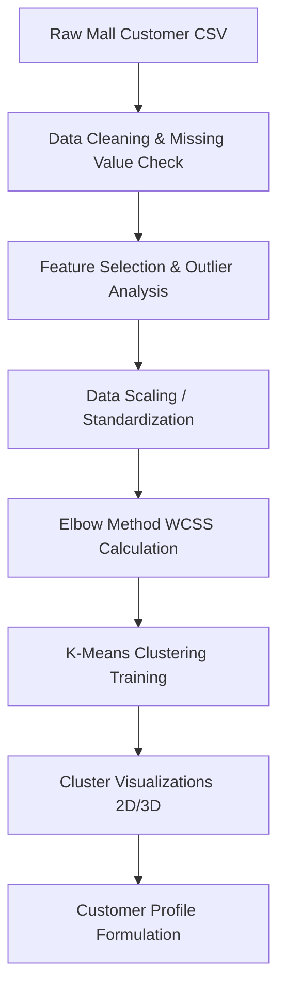

# synent-task6-customersegmentation-rudrapatel
> **Synent Technologies - Data Science Internship (Summer 2026)**  
> **Task 6: Customer Segmentation & Behavioral Analysis**

---

## 📌 Project Title
**Customer Segmentation & Behavioral Analysis using K-Means Clustering**

---

## 📝 Problem Statement
In highly competitive retail sectors, generic mass marketing campaigns are increasingly inefficient. To optimize marketing spend and design effective loyalty rewards, retail stores need to segment customers based on their annual income and spending behaviors, allowing managers to target specific buying profiles.

---

## 🎯 Business Objective
The goal is to apply unsupervised machine learning to group customers based on demographic and behavioral data (Annual Income, Spending Score). Specifically, this project:
- Standardizes features to prevent scale distortions in distance metrics.
- Uses the Elbow Method to identify the optimal number of clusters ($K = 5$).
- Fits a robust K-Means model to cluster the customer base.
- Generates 2D and 3D visual representations of customer cohorts.
- Formulates tailored marketing strategies for each segment.

---

## 📊 Dataset Information
* **Dataset Name:** `Mall_Customers.csv`
* **Format:** CSV (Comma-Separated Values)
* **Shape:** $200$ rows, $5$ columns
* **Fields & Columns:**
  * `CustomerID`: Unique identification number for each customer
  * `Gender`: Biological sex of the customer (`Male`, `Female`)
  * `Age`: Age of the customer in years
  * `Annual Income (k$)`: Annual income of the customer in thousands of dollars
  * `Spending Score (1-100)`: Score assigned by the mall based on customer behavior and spending nature

---

## 🔄 Project Workflow

---

## 🛠️ Tools & Technologies
- **Programming Language:** Python 3.10+
- **Data Manipulation:** `pandas`, `numpy`
- **Machine Learning:** `scikit-learn`
- **Data Visualization:** `matplotlib`, `seaborn`, `plotly`
- **Environment:** Jupyter Notebook, VS Code
- **Model Serialization:** `joblib`

---

## 🧪 Methodology
1. **Data Cleaning:** Checked for null values and duplicate records (no missing values or duplicates found).
2. **Feature Selection:** Selected the core clustering metrics: `Annual Income (k$)` and `Spending Score (1-100)`.
3. **Feature Scaling:** Applied `StandardScaler` to normalize dimensions and ensure balanced distance contributions.
4. **Optimal Cluster Count Determination:** Evaluated WCSS (Within-Cluster Sum of Squares) across a range of $K = 1$ to $K = 10$, locating the inflection point at $K = 5$.
5. **K-Means Clustering:** Trained K-Means on the normalized dataset using the optimal $K = 5$.
6. **Cohort Visualization:** Plotted unscaled coordinates with red/black centroids, and exported an interactive 3D HTML plot mapping Age vs. Income vs. Spending Score.

---

## 🏆 Results & Segment Profiles
The K-Means clustering algorithm identified **5 distinct customer cohorts**:
1. **Standard Customers (Cluster 0):** Average income ($40\text{k}$-$70\text{k}$), average spending score ($40$-$60$). (*81 customers*)
2. **Champions (Cluster 1):** High income ($>70\text{k}$), high spending score ($>60$). (*39 customers*)
3. **Low-Value Cohort (Cluster 2):** Low income ($<40\text{k}$), low spending score ($<40$). (*22 customers*)
4. **Careless Spenders (Cluster 3):** Low income ($<40\text{k}$), high spending score ($>60$). (*35 customers*)
5. **Conserving Spenders (Cluster 4):** High income ($>70\text{k}$), low spending score ($<40$). (*23 customers*)

---

## 📈 Visualizations
Static charts are saved in the [images/](file:///c:/COLLEGE/Synent-Internship-2026/Task-6-Customer-Segmentation/images/) directory:
1. **[elbow_method.png](file:///c:/COLLEGE/Synent-Internship-2026/Task-6-Customer-Segmentation/images/elbow_method.png):** The Elbow curve showing inflection at $K = 5$.
2. **[customer_clusters_2d.png](file:///c:/COLLEGE/Synent-Internship-2026/Task-6-Customer-Segmentation/images/customer_clusters_2d.png):** 2D Scatter plot mapping Annual Income vs. Spending Score with red/black Centroids.
3. **[customer_clusters_3d.html](file:///c:/COLLEGE/Synent-Internship-2026/Task-6-Customer-Segmentation/reports/customer_clusters_3d.html):** 3D Interactive Plotly scatter plot mapping Age vs. Income vs. Spending Score (located under `reports/`).

---

## 🚀 Future Improvements
- Test alternative clustering algorithms such as Hierarchical Clustering (Dendrograms) or DBSCAN.
- Incorporate RFM (Recency, Frequency, Monetary) values to capture transactional depth.

---

## 👤 Author Information
- **Name:** Rudra Patel
- **Internship ID:** `[Your Internship ID]`
- **Email:** `[Your Email]`
- **LinkedIn Profile:** `[Your LinkedIn Link]`
- **GitHub Profile:** `[Your GitHub Link]`
