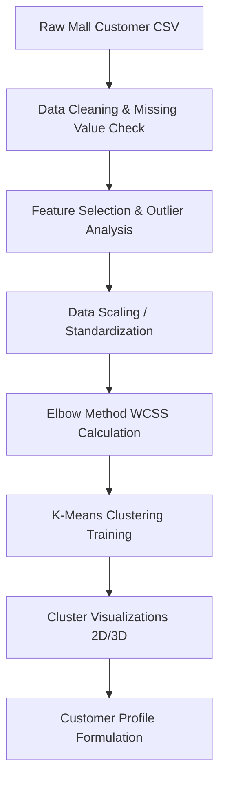

# synent-task6-customersegmentation-rudrapatel
> **Synent Technologies - Data Science Internship (Summer 2026)**
> **Task 6: Customer Segmentation**

---

## 📌 Project Title
**Customer Segmentation & Behavioral Analysis using K-Means Clustering**

---

## 📝 Problem Statement
In highly competitive retail and service sectors, one-size-fits-all marketing campaigns are increasingly inefficient. Companies need to understand the distinct purchasing habits, income brackets, and spending profiles of their customers. Without clustering customers into meaningful cohorts, it is difficult to design targeted loyalty programs, optimize pricing, or tailor product recommendations.

---

## 🎯 Business Objective
The goal is to apply unsupervised machine learning to group customers based on demographic and behavioral data (e.g., Annual Income, Spending Score). Specifically, this project aims to:
- Preprocess and normalize raw customer profiling datasets.
- Use empirical methods (the Elbow Method and Silhouette Analysis) to determine the optimal number of customer segments.
- Train a robust K-Means clustering algorithm on customer features.
- Visualize customer cohorts in intuitive 2D/3D spaces.
- Describe the profiles of each cluster to provide actionable marketing strategies.

---

## 📊 Dataset Information
* **Dataset Name:** Mall_Customers.csv
* **Format:** CSV (Comma-Separated Values)
* **Shape:** 200 rows, 5 columns
* **Fields & Columns:**
  * `CustomerID`: Unique identification number for each customer
  * `Gender`: Biological sex of the customer (`Male`, `Female`)
  * `Age`: Age of the customer in years
  * `Annual Income (k$)`: Annual income of the customer in thousands of dollars
  * `Spending Score (1-100)`: Score assigned by the mall based on customer behavior and spending nature

---

## 🔄 Project Workflow

---

## 🛠️ Tools & Technologies
- **Programming Language:** Python 3.10+
- **Data Manipulation:** `pandas`, `numpy`
- **Machine Learning:** `scikit-learn`
- **Data Visualization:** `matplotlib`, `seaborn`, `plotly`
- **Environment:** Jupyter Notebook, VS Code

---

## 🧪 Methodology
1. **Data Cleaning:** Inspect for missing entries, handle inconsistent column names, and check for negative/extreme values.
2. **Feature Selection:** Filter attributes that contribute directly to buyer behavior (e.g., Age, Annual Income, Spending Score).
3. **Scaling:** Normalize features (like Annual Income vs. Spending Score) using StandardScaler or MinMaxScaler to prevent distance-bias in K-Means.
4. **Optimal Cluster Count Determination:** Execute the Elbow Method by evaluating WCSS (Within-Cluster Sum of Squares) across a range of K (e.g., 1 to 10).
5. **K-Means Clustering:** Train the final model using the selected K and label each customer in the dataset.
6. **Cohort Visualization:** Plot results using multi-dimensional Scatter plots with distinct color palettes for each cluster.

---

## 🏆 Results Section
*To be filled once the dataset is provided and clustering is complete.*
- **Optimal Number of Clusters (K):** `[Placeholder]`
- **Segment Breakdown:**
  1. *Cluster 0 (Profile name):* `[Placeholder]`
  2. *Cluster 1 (Profile name):* `[Placeholder]`
  3. *Cluster 2 (Profile name):* `[Placeholder]`

---

## 📈 Visualizations Section
*Sample charts will be saved under the `images/` directory.*
- `[Placeholder: Elbow Method WCSS Curve]`
- `[Placeholder: 2D Scatter Plot of Annual Income vs. Spending Score Clusters]`
- `[Placeholder: 3D Interactive Scatter Plot of Age vs. Income vs. Spending Score]`

---

## 🚀 Future Improvements
- Apply alternative clustering algorithms like Hierarchical Clustering (Dendrograms) or DBSCAN.
- Incorporate RFM (Recency, Frequency, Monetary) metrics for dynamic database clustering.
- Automate cluster label assignments as new transactions roll in.

---

## 👤 Author Information
- **Name:** Rudra Patel
- **Internship ID:** `[Your Internship ID]`
- **Email:** `[Your Email]`
- **LinkedIn Profile:** `[Your LinkedIn Link]`
- **GitHub Profile:** `[Your GitHub Link]`
